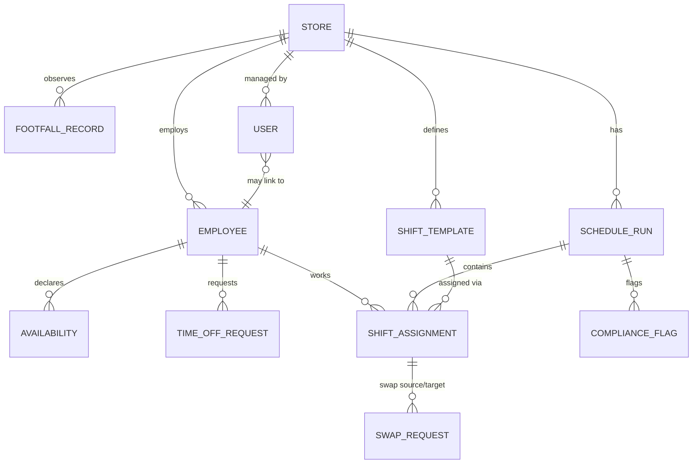

# Data Model

All tables live in one PostgreSQL database, managed by SQLAlchemy models (`backend/app/models/`) and versioned via Alembic migrations (`backend/alembic/versions/`).

## Entity relationship diagram

## Tables and why each field exists

### `stores`
The top-level scoping entity - almost every other table hangs off a `store_id`. `footfall_to_staff_ratio`, `min_staff_floor`, and `avg_transaction_value` are nullable *per-store overrides* of app-wide defaults (`app/config.py`), so an owner can tune one busy flagship store differently without having to fill in every field for all 8 stores on day one.

### `employees`
`wage_rate` is nullable and currently unused by the optimizer's objective (confirmed with the owner: no wage data exists yet - v1 minimizes total scheduled hours as a cost proxy instead). The column exists now so that populating it later turns on true labor-cost minimization with a one-line change in `app/services/optimization/cost.py` - no migration needed. `employment_type` and `hire_date` are descriptive/reporting fields, not used by the solver in v1.

### `availabilities`
A recurring weekly window (`day_of_week` + `start_time`/`end_time`), optionally bounded by `effective_from`/`effective_until` for a temporary change, and `is_available` to express an explicit exception ("normally free Tuesdays, but not this specific one") without a separate exceptions table. The optimizer treats "no matching available row" and "an explicit unavailable row" both as *not available* - see `app/services/optimization/availability_index.py`.

### `time_off_requests`
Deliberately a separate table from `availabilities`, even though both answer "when can't this person work." A time-off request has its own approval workflow and audit trail (`status`, `resolved_by_user_id`, `resolved_at`) - folding it into `availabilities` would blur "this is a standing weekly pattern" with "this is a one-time approved absence," making the history harder to reason about later.

### `shift_templates`
Fixed, store-defined shift slots (e.g. "Morning" 08:00-13:00) rather than arbitrary continuous time ranges. This is a deliberate simplification, not a limitation of the solver - see [forecasting-and-optimization.md](forecasting-and-optimization.md) for the full reasoning. `day_of_week = NULL` means the template runs every day; setting it restricts a template to specific days (e.g. a weekend-only extra shift).

### `footfall_records`
One row per store/date/hour-block/source. `source` (`synthetic` / `shopify` / `camera`) exists so that a live Shopify sync can write into the *same table* real data flows through, without an ambiguous migration from the synthetic seed data - both can coexist, tagged by source, and the forecaster can be told later to prefer one source over another.

### `labor_rule_configs`
Every labor rule the optimizer and compliance checker enforce (overtime threshold, minimum rest, required break, max consecutive days) is a **row in this table**, not a constant in code - because these are business/legal parameters that change, and hardcoding them would mean a code deployment every time a rule changes. `store_id = NULL` means "the global default"; a store-specific row overrides it. `effective_from` is what makes an old `ScheduleRun` auditable against the rules that were *actually in force* when it was generated, even after rules change later.

### `holiday_calendar_entries`
A manually-maintained multiplier applied to the forecast on known unusual-traffic dates (Black Friday, New Year's Day, etc.). This is intentionally a lookup table an owner edits, not a fetched public holiday API - the actual traffic impact of a given date is a business judgment call specific to *this* retailer, not a fact.

### `schedule_runs`
The aggregate root for one optimizer pass: one store, one week. `forecast_snapshot` (JSON) freezes the exact predicted-footfall/required-headcount numbers the solver worked from, so the manager review UI can explain "why does the draft look like this" without re-running the (possibly-since-changed) live forecaster, and so that explanation stays fixed for audit purposes. `solver_status` (`optimal` / `feasible` / `infeasible`) tells the review UI whether the solver is confident it found the *best* answer or ran out of time, or couldn't fully cover demand even with penalized slack.

### `shift_assignments`
One employee working one shift template on one date, within one schedule run. `manually_edited` tracks whether a human overrode what the solver originally proposed - a rising manual-edit rate for a given store is the intended v1 signal that its `footfall_to_staff_ratio` needs owner attention (see [scaling-guide.md](scaling-guide.md)'s feedback-loop note). `status` (`proposed` / `edited` / `published`) is what enforces "employees never see a draft" at the API layer.

### `swap_requests`
A trade between two **published** assignments only - swapping against an unpublished draft doesn't make sense, since the employee has no confirmed shift yet to trade away. `target_assignment_id` is nullable to leave room for an "open swap" (claimable by any willing employee) as a future extension; v1 ships the direct employee-to-employee case, per the documented v1 assumption that any employee may swap with any other within the same store (no skill/role differentiation yet).

### `compliance_flags`
Persisted rather than computed fresh on every page load, specifically so the audit trail survives a fix - an owner can see later that a run *had* an overtime flag that got resolved before publish, not just that the published version looks clean now. `severity` (`hard` / `soft`) is what the publish endpoint checks: any unresolved hard flag blocks publishing; soft flags are shown but don't block.

### `users`
Deliberately separate from `employees` - a Store Manager or Owner account doesn't necessarily correspond to a row in `employees` (they might not be scheduled for shifts), and an `Employee` can exist in the schedule before they've been given portal login credentials at all. `role` (`owner` / `store_manager` / `employee`) plus a single nullable `store_id` implements "one manager per store, one owner sees all stores" (confirmed scope) - if a manager ever needs to cover multiple stores, this FK would need to become a join table, which is a schema change flagged in [scaling-guide.md](scaling-guide.md) rather than something v1 tries to anticipate.
